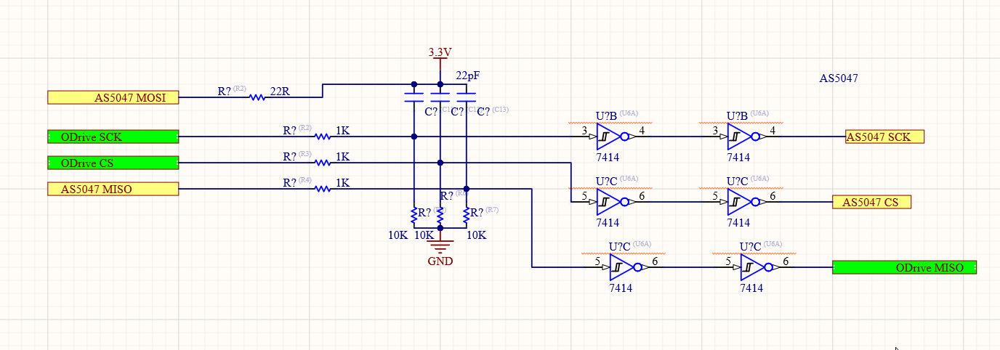

# Get State machine của Device

- [x] ``` odrv0.axis0.current_state ```
- [x] ``` dump_errors(odrv0, True) ```
# Cài đặt thông số motor
**Motor 1**
- [x] ```odrv0.config.brake_resistance = 0.5``` Điện trở xả 

- [x] ```odrv0.axis0.motor.config.current_lim = 3``` limit 10A
- [x] ```odrv0.axis0.controller.config.vel_limit = 500000``` la 20000[counts/s].
- [x] ```odrv0.axis0.motor.config.calibration_current = 2.0```
- [x] ```odrv0.axis0.motor.config.pole_pairs = 21 ``` Poles pair
- [ ] ```odrv0.axis0.motor.config.motor_type = MOTOR_TYPE_HIGH_CURRENT```   # select if you have a gimbal or high amp motor
- [x] ```odrv0.axis0.motor.config.motor_type = MOTOR_TYPE_GIMBAL```         # là 2
- [x] ```odrv0.axis0.motor.config.resistance_calib_max_voltage = 12.0```

**Motor 2**
- [ ] ```odrv0.axis1.motor.config.current_lim = 3``` 
- [ ] ```odrv0.axis1.controller.config.vel_limit = 500000``` la 20000[counts/s].
- [ ] ```odrv0.axis1.motor.config.calibration_current = 2.0```
- [ ] ```odrv0.axis1.motor.config.pole_pairs = 20 ``` Poles pair
- [ ] ```odrv0.axis1.motor.config.motor_type = MOTOR_TYPE_HIGH_CURRENT``` 
- [ ] ```odrv0.axis1.motor.config.resistance_calib_max_voltage = 12.0```

- [x] ```odrv0.save_configuration() ```
- [x] ```odrv0.reboot()```


# calib motor 

**Motor 1**
- [x] odrv0.axis0.motor.config.pre_calibrated = False
- [x] odrv0.axis0.requested_state=AXIS_STATE_MOTOR_CALIBRATION 
- [x] odrv0.axis0.motor.config.pre_calibrated =True de luu thong so calib motor ( R và L)
- [x] odrv0.axis0.motor.config.phase_resistance = 0.13
- [x] odrv0.axis0.motor.config.phase_inductance = 0.00002


**Motor 2**
- [x] odrv0.axis1.motor.config.pre_calibrated =False
- [x] odrv0.axis1.requested_state=AXIS_STATE_MOTOR_CALIBRATION 
- [x] odrv0.axis1.motor.config.pre_calibrated =True
- [x] odrv0.axis1.motor.config.phase_resistance = 0.048
- [x] odrv0.axis1.motor.config.phase_inductance = 0.000018


Save và reboot 
------------
```
odrv0.save_configuration()
odrv0.reboot()
```

# SPI : encoder

1. Connect Encoder
-----------




- [x] The encoder's SCK, MISO (aka "DATA" on CUI encoders), GND and 3.3V should connect to the ODrive pins with the same label.
- [x] The encoder's MOSI should be tied to 3.3V (AMS encoders only. CUI encoders don't have this pin.)
- [x] The encoder's Chip Select (aka nCS/CSn) can be connected to any of the ODrive's GPIOs (caution: GPIOs 1 and 2 are usually used by UART).


2. Setting Encoder AS5047D.
---------

```
- odrv0.axis0.encoder.config.abs_spi_cs_gpio_pin = 6  # or which ever GPIO pin you choose
- odrv0.axis0.encoder.config.mode = 257               # or ENCODER_MODE_SPI_ABS_AMS là x101 = 257
- odrv0.axis0.encoder.config.cpr = 2**14              # or 2**12 for AMT232A and AMT233A

- odrv0.axis1.encoder.config.abs_spi_cs_gpio_pin = 4  # or which ever GPIO pin you choose
- odrv0.axis1.encoder.config.mode = 257               # or ENCODER_MODE_SPI_ABS_AMS là x101 = 257
- odrv0.axis1.encoder.config.cpr = 2**14              # or 2**12 for AMT232A and AMT233A

- odrv0.save_configuration()
- odrv0.reboot()
```

3. Setting Encoder Calib.
-----------

 - [x] odrv0.axis0.encoder.config.calib_range = 0.05                   # helps to relax the accuracy of encoder counts during calibration
 - [x] odrv0.axis0.motor.config.resistance_calib_max_voltage = 12.0    # sometimes needed depending on motor
 
 Đôi khi cần chỉnh các thông số motor lại:
 
 - [x] ```odrv0.axis0.controller.config.vel_limit = 500000``` la 20000[counts/s].
 - [x] ```odrv0.axis0.motor.config.calibration_current = 2.0```

4. Calib
-----------------

- [x] CHuyển Fre Calib to False ```odrv0.axis0.encoder.config.pre_calibrated = False```
- [x] Chuyển mode calib         ```odrv0.axis0.requested_state = AXIS_STATE_ENCODER_OFFSET_CALIBRATION```
- [x] CHuyển Fre Calib to True  ```odrv0.axis0.encoder.config.pre_calibrated = True ```

5. Save Calib
--------------

Test

- [x] odrv0.axis0.requested_state = AXIS_STATE_CLOSED_LOOP_CONTROL    # Convert mode to close loop
- [x] odrv0.axis0.controller.input_pos = 10000	 		# Di chuyển motor
- [x] odrv0.axis0.requested_state = AXIS_STATE_IDLE			# Convert to free mode
- [x] odrv0.save_configuration()
- [x] odrv0.reboot()


# Step/Dir/Enbale

1. Cài Pin
----------

```
odrv0.axis0.config.step_gpio_pin = 1
odrv0.axis0.config.dir_gpio_pin =  2
odrv0.axis0.config.en_gpio_pin =  5
```
2. Enbale status 
------------

```
odrv0.axis0.config.enable_step_dir = True
odrv0.axis0.config.use_enable_pin =  True
```
3. Cài trạng thái của chân enable
-----------

```
odrv0.axis0.config.enable_pin_active_low = False
```
4. Thông số khác
-----------

```
odrv0.axis0.config.step_dir_always_on = False
odrv0.axis0.config.counts_per_step =  2.0
```
5. Save và reboot
-----------------
```
odrv0.save_configuration()
odrv0.reboot()
```
# PID


```
odrv0.axis0.controller.config.pos_gain = 2000.0 
odrv0.axis0.controller.config.vel_gain = 0.000001
odrv0.axis0.controller.config.vel_integrator_gain = 
```
- Test Move ```odrv0.axis0.controller.input_pos = 10000```
- Input Mode ```odrv0.axis0.controller.config.input_mode = 3```
- odrv0.axis0.controller.config.input_filter_bandwidth = 3.0 // thời gian tăng tốc giảm tốc cho input mode pos filller efault: 2.0
```
    enum InputMode_t{
        INPUT_MODE_INACTIVE,
        INPUT_MODE_PASSTHROUGH,
        INPUT_MODE_VEL_RAMP,
        INPUT_MODE_POS_FILTER,
        INPUT_MODE_MIX_CHANNELS,
        INPUT_MODE_TRAP_TRAJ,
        INPUT_MODE_CURRENT_RAMP,
        INPUT_MODE_MIRROR,
    };
```
	float pos_gain = 20.0f;                         // [(counts/s) / counts]
        float vel_gain = 5.0f / 10000.0f;               // [A/(counts/s)]
        float vel_integrator_gain = 10.0f / 10000.0f;   // [A/(counts/s * s)]
        float vel_limit = 20000.0f;                     // [counts/s] Infinity to disable.
        float vel_limit_tolerance = 1.2f;               // ratio to vel_lim. Infinity to disable.
        float vel_ramp_rate = 10000.0f;                 // [(counts/s) / s]
        float current_ramp_rate = 1.0f;                 // A / sec
        bool setpoints_in_cpr = false;
        float inertia = 0.0f;                           // [A/(count/s^2)]
        float input_filter_bandwidth = 2.0f;            // [1/s]
        float homing_speed = 2000.0f;                   // [counts/s]
        Anticogging_t anticogging;
        float gain_scheduling_width = 10.0f;
        bool enable_gain_scheduling = false;
        bool enable_vel_limit = true;
        bool enable_overspeed_error = true;
        bool enable_current_vel_limit = true;           // enable velocity limit in current control mode (requires a valid velocity estimator)
        uint8_t axis_to_mirror = -1;
        float mirror_ratio = 1.0f;
        uint8_t load_encoder_axis = -1;     


resistance_calib_max_voltage > calibration_current * phase_resistance = 3*0.0550.165

resistance_calib_max_voltage < 0.5 * vbus_voltage
